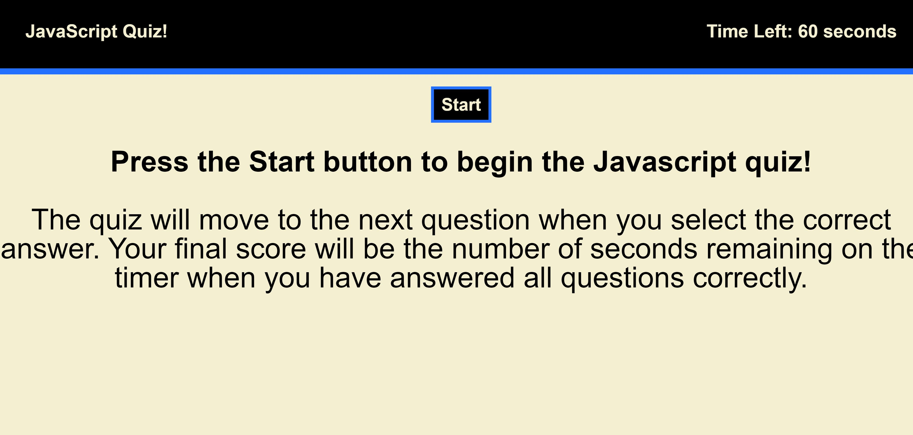
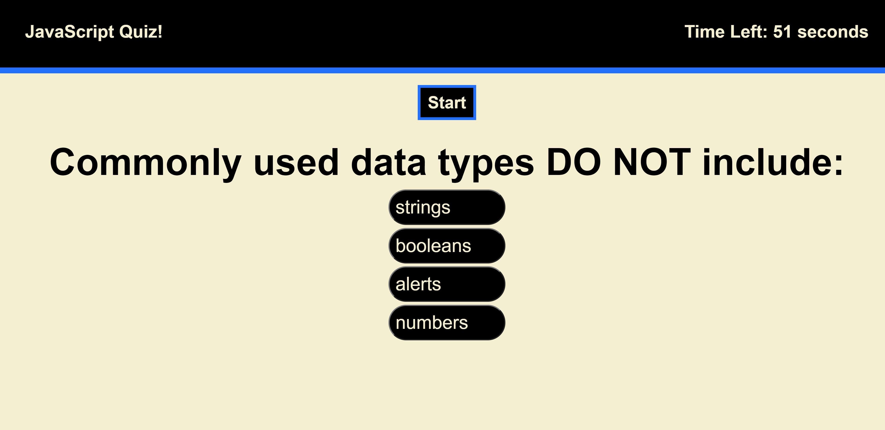
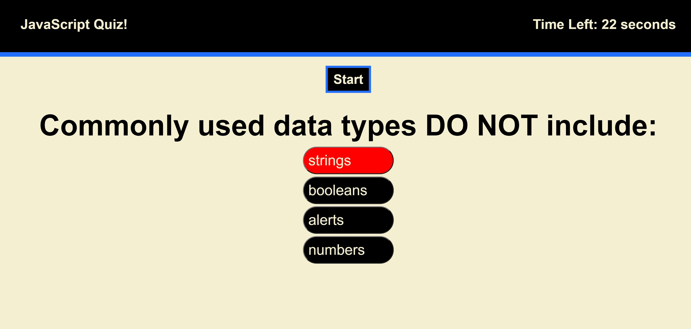
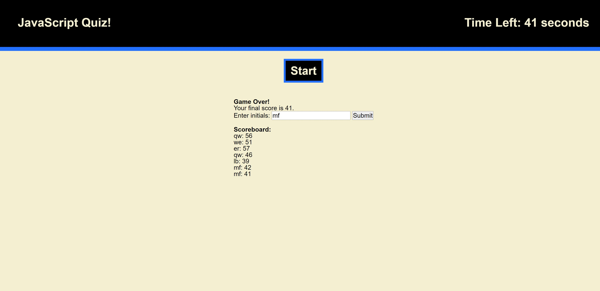

# JavaScript-Quiz

Deployed Application: https://mlfitz2.github.io/JavaScript-Quiz/
GitHub Repository: https://github.com/mlfitz2/JavaScript-Quiz 

This project is a dynamically-updating quiz on JavaScript questions. 

Upon loading, the user is shown a welcome screen with a Start button and instructions. After clicking Start, a 60-second timer begins counting down. The text on the welcome screen is removed using JavaScript, and replaced with the first question and four answer choices. If the user clicks on an incorrect answer, it will turn red and the user will be penalized by 5 seconds being removed from the timer. 

Clicking the correct answer will prompt the questions and answers to be replaced by the next batch. When all questions have been answered correctly, or when the timer gets to 0, the game is over. The questions are then replaced by a prompt for the user to enter their initials. When these are entered, the game uses Local Storage to display a list of users' initials and their scores. 

The HTML begins with the elements of the opening instructions under the start button. JavaScript is used to hide the other elements upon loading, and then to hide the intro and bring out the question once the start button is clicked. The list of questions are in an array, and when each is answered correctly the [round] of the array goes up by one, which brings up the following question. 

